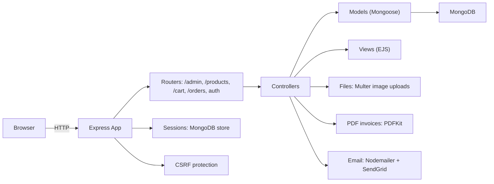

## E‑Commerce Platform

Node.js + Express E‑Commerce web app with authentication, product management, cart, orders, and PDF invoices.

### Badges


### Description

This project is a learning‑focused E‑Commerce platform built with Express and EJS, backed by MongoDB. It includes user authentication (signup, login, logout, password reset via email OTP), role‑based access control for admin product management, a shopping cart and orders, and on‑the‑fly PDF invoice generation. Security features include hashed passwords, session storage in MongoDB, CSRF protection, and server‑side validation.

### Table of Contents

- [Features](#features)
- [Tech Stack](#tech-stack)
- [Architecture Overview](#architecture-overview)
- [Installation](#installation)
- [Usage](#usage)
- [Environment Variables](#environment-variables)
- [Deployment](#deployment)
- [Contributing](#contributing)
- [License](#license)
- [Credits & Acknowledgements](#credits--acknowledgements)

## Features

### Authentication & Authorization

- **Signup/Login/Logout** using sessions (`express-session`) with MongoDB session store (`connect-mongodb-session`).
- **Password reset via OTP**: one‑time code emailed using Nodemailer + SendGrid; token stored hashed with expiration.
- **Role‑based access**: `user` and `admin` roles; admin‑only routes for product management; user‑only routes for cart and orders.
- **Validation & CSRF**: input validation via `express-validator` and CSRF protection via `csurf`.

### Product Management (Admin)

- **Add product** with title, description, price, and image upload (via `multer` to `images/productImages`).
- **Edit product** including image replacement (old image removed from disk).
- **Delete product** (image file removed from disk).
- **Admin products listing** view.

### Catalog (Public)

- **Products list** with pagination (`page` query param, fixed limit 2).
- **Product detail** page.

### Cart (User)

- **Add to cart**, **increase/decrease quantity**, **remove item**, **clear cart**. Cart stored on the user document.
- **Auto‑sync on product update**: title/price/image reflected in user carts when admin edits a product.

### Orders (User)

- **Create order** from cart and **view orders**.
- **Invoice PDF generation** with `pdfkit`; invoices saved under `data/invoices` and streamed inline.

### Views & UI

- Server‑rendered pages using **EJS** templates in `views/` with static assets in `public/`.

## Tech Stack

- **Runtime/Frameworks**:
  - Express `^5.1.0` (ESM)
  - EJS `^3.1.10`
- **Database**:
  - MongoDB via Mongoose `^8.14.3`
  - Session store: `connect-mongodb-session` `^5.0.0`
- **Auth & Security**:
  - `express-session` `^1.18.1`
  - `csurf` `^1.2.2`
  - `bcryptjs` `^3.0.2`
  - `connect-flash` `^0.1.1`
- **Validation**:
  - `express-validator` `^7.2.1`
- **File Uploads & Files**:
  - `multer` `^2.0.0`
  - Local storage under `images/productImages`
- **Mailing**:
  - `nodemailer` `^7.0.3` with `nodemailer-sendgrid-transport` `^0.2.0`
- **PDF Generation**:
  - `pdfkit` `^0.17.1`
- **Utilities**:
  - `dotenv` `^16.5.0`

## Architecture Overview

The app is a classic server‑rendered Express application:



- Images are uploaded via `multer` to `images/productImages/` and cleaned up on edit/delete.
- PDF invoices are generated on demand and written to `data/invoices/`.
- CSRF tokens are injected into views via `res.locals.csrfToken`.

## Installation

```bash
git clone <your-repo-url>
cd E-Commerce-Platform
npm install
```

Create a `.env` file in the project root:

```bash
# .env
MONGODB_URL=mongodb+srv://<user>:<password>@<cluster-name>/<db-name>?retryWrites=true&w=majority
SESSION_SECRET=your_super_secret_session_key
SENDGRID_API_KEY=SG.xxxxxxxx.yyyyyyyyyyyyyyyyyyyyyyyyy
```

Start in development (with nodemon):

```bash
npm run dev
```

Or start normally:

```bash
npm start
```

The server runs at `http://localhost:3000`.

## Usage

- **Browse products**: `GET /products` (with `?page=<n>` pagination).
- **View product**: `GET /products/:productId`.
- **Register**: `GET /signup` → submit form to `POST /signup`.
- **Login**: `GET /login` → submit form to `POST /login`.
- **Logout**: `POST /logout`.
- **Reset password**:
  - `GET /verify` → submit email to `POST /verify` (OTP sent via email)
  - `POST /check` with `email` and `resetToken`
  - `GET /reset/:hashedToken` → `POST /reset` to set a new password
- **Cart (user role)**: `GET /cart`, `POST /cart`, `POST /cart/increase`, `POST /cart/decrease`, `POST /cart/remove`, `POST /cart/clear`.
- **Orders (user role)**: `GET /orders`, `POST /orders`, `GET /orders/invoice/:orderId` (inline PDF).
- **Admin (admin role)**:
  - `GET /admin/products` (list)
  - `GET /admin/add-product` → `POST /admin/add-product`
  - `GET /admin/edit-product/:productId` → `POST /admin/edit-product/:productId`
  - `POST /admin/delete-product`

Notes:

- Admin routes require a user with `role: "admin"` in the database. By default, new signups are `user` role.
- When creating/editing products, the image input name in the form should be `productImage` (as configured in `multer`).
- Include the hidden CSRF token in all forms using the value exposed as `csrfToken` in templates.

## Environment Variables

- **MONGODB_URL**: MongoDB connection string.
- **SESSION_SECRET**: Secret used to sign the session ID cookie.
- **SENDGRID_API_KEY**: API key for SendGrid used by Nodemailer to send emails.

Example `.env` content is provided in the [Installation](#installation) section.

## Deployment

This is a standard Node.js server with MongoDB. To deploy:

1. Provision a MongoDB database and obtain the connection URI.
2. Set the required environment variables (`MONGODB_URL`, `SESSION_SECRET`, `SENDGRID_API_KEY`) on your hosting platform.
3. Use `npm start` as the start command. Ensure the app can bind to port `3000` or configure your platform to proxy to that port.
4. Make sure the app has a writable filesystem for `images/productImages/` and `data/invoices/` or mount persistent storage/volumes.

## Contributing

Contributions are welcome!

1. Fork the repository and create your feature branch: `git checkout -b feature/your-feature`.
2. Commit your changes with clear messages.
3. Ensure new code includes adequate validation and CSRF coverage for forms.
4. Open a Pull Request describing the change and rationale.

## License

ISC.

## Credits & Acknowledgements

- Built by Ahmed Reda.
- Libraries: Express, EJS, Mongoose, Multer, PDFKit, Nodemailer, SendGrid transport, CSRF, express‑validator, connect‑flash.


